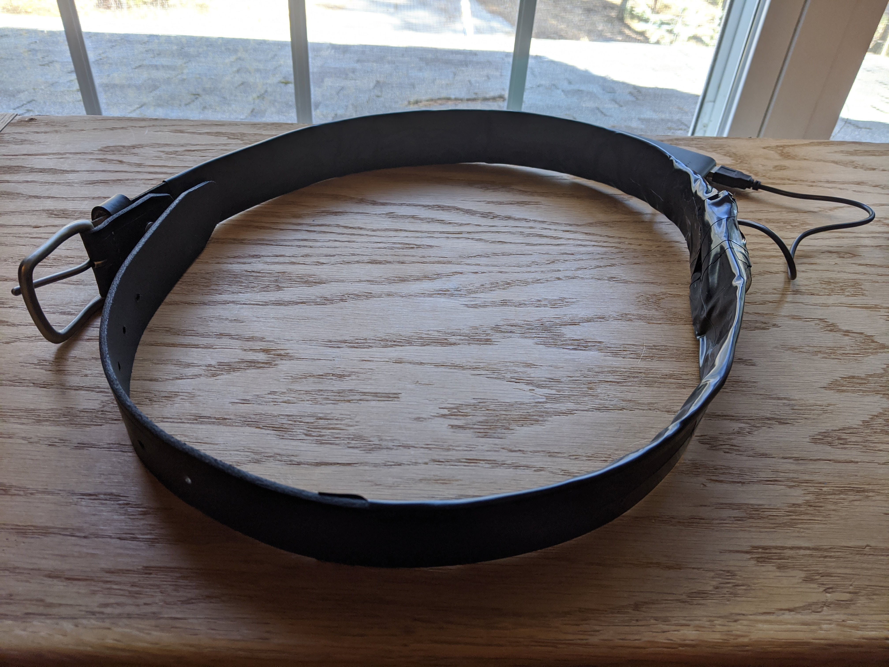
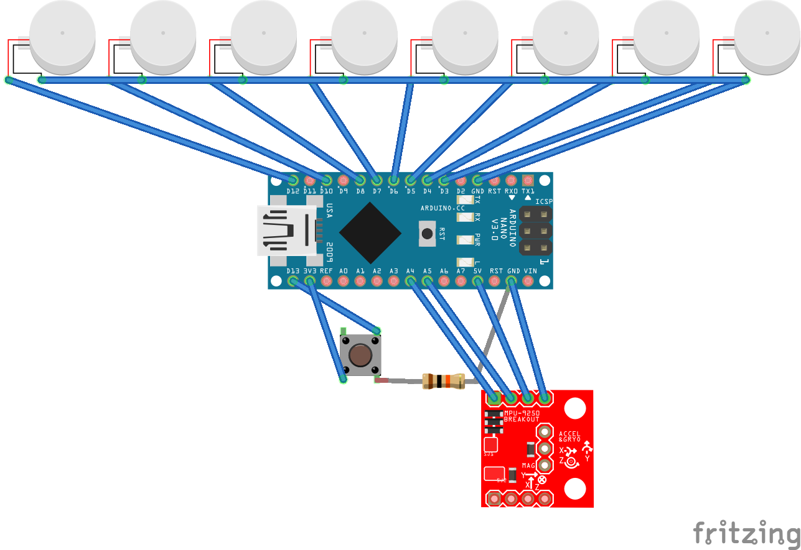

# Compass Belt
An Arduino powered belt that vibrates toward North.

Human perception has always been limited to our biological senses, but what if we could change that? And no, I am not talking about the fantasy or science fiction. In nature, there are animals with the ability to sense magnetic fields, barometric pressure, ambient electricity, and thermal radiation. With this project, I explored what it would feel like for a human (AKA me) to have new senses, powered by modern technology. For the scope of this research, I experimented with magnetoreception. I used an Arduino Nano with an inexpensive magnetometer and coin vibration motors for feedback devices. I embedded the device into a belt and combined it with a battery pack to make it portable. 

## Materials Used
- Arduino Nano
- MPU-9250 (magnetometer)
- 8 coin vibration motors
- Button
- 10K resistor
- Mini USB cable
- Belt (I used a men's 38 Wrangler leather belt)
- Battery pack
- Hot glue
- Soldering kit

## Libraries Required
- [Bolderflight MPU9250](https://github.com/bolderflight/MPU9250)
- [Kalman Filter](https://github.com/kylecorry31/kalman-filter)

## Instructions
1. While wearing the belt, make a mark on it every 45 degrees starting with directly in front of you. This is where the motors will be placed. The Arduino, magnetometer, and button will be placed between the motor directly behind you (S) and the one to the right or left of it (SE or SW). I will refer to all motors by their cardinal direction, assuming the North is the front of the belt.

2. Secure the vibration motors onto the belt where marked. The vibration motors I used had sticky backings which made this easy.

3. Join the Arduino, magnetometer, and button using hot glue to make them easy to secure onto the belt.

4. Secure the Arduino to the belt. I used a zip tie at this stage, because I replaced it in step 6.

5. Assemble the circuit shown in the following schematic. Note: The schematic shows the vibration motors sharing a common ground wire - this makes attaching to the Arduino easier but is not required. You will probably need to attach extra lengths of wire to the motors and should insert a USB cable into the Arduino. 

6. Wrap the circuit in electrical tape. For the best results, get electrical tape with equal width as the belt and wrap the whole belt, leaving just a USB cable exposed for the Arduino.

7. Upload this sketch to the Arduino after installing the required libraries.

8. Attach the battery pack to the Arduino's USB and store in a pocket or secure it to the belt.

9. Press the button to toggle between discrete mode (small pulse toward North only when direction changes) or always on mode (always vibrate toward North). 

## Theory
This project was heavily inspired by the work of [David Eagleman](https://www.ncbi.nlm.nih.gov/pubmed/26080756). The quick summary of this article is that vibration motors can be placed on the skin and coded sensor information can be used to turn them on in a specific pattern which will eventually be subconsciously perceived by the wearer. 